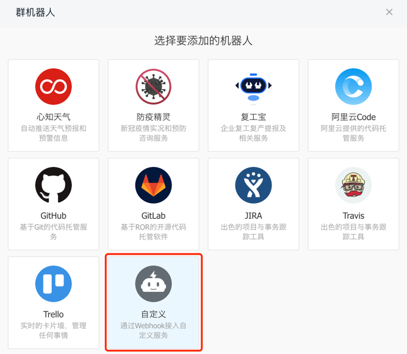
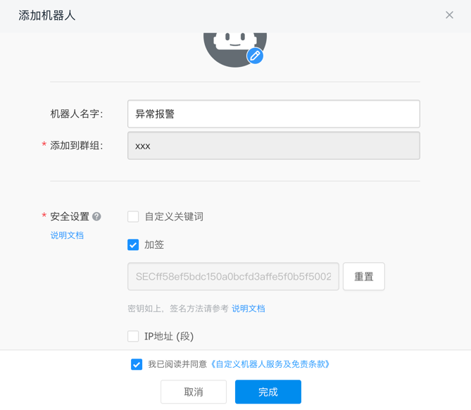
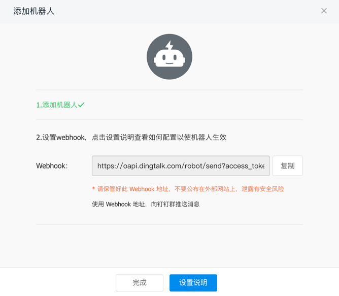

# dingtalk

> 钉钉群机器人SDK

## 安装

```go
go get github.com/shockerli/dingtalk
```

## 使用

### 初始化配置

```go
var robot = dingtalk.NewRobotCustom()
robot.SetWebhook("your_robot_webhook")
robot.SetSecret("your_secret") // 可选
```

### Text

```go
robot.SendText("TEST: Text")
```

### AtAll

```go
robot.SendText("TEST: Text&AtAll", robot.AtAll())
```

### AtMobiles

```go
robot.SendText("TEST: Text&AtMobiles", robot.AtMobiles("19900001111"))
```

### Link

```go
robot.SendLink("TEST: Link", "link content", "https://github.com/shockerli", "https://www.wangbase.com/blogimg/asset/202101/bg2021011601.jpg")
```

## 获取群机器人Token

- 选择自定义机器人

  

- 设置机器人

  

- 获取Webhook&token

  

## 测试

1. 打开 `robot_test.go` 文件，修改 `your_access_token` 和 `your_secret`；
2. 运行单元测试 `go test -v *_test.go`；
